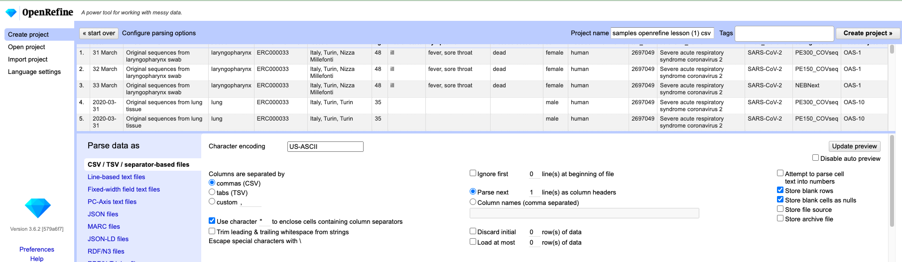

# Lesson

## Creating a new OpenRefine project

In Windows, you can start the OpenRefine program by double-clicking on the openrefine.exe file. Java services will start automatically on your machine, and OpenRefine will open in your browser. On a Mac, OpenRefine can be launched from your Applications folder. If you are using Linux, you will need to navigate to your OpenRefine directory in the command line and run `./refine`.

OpenRefine can import a variety of file types, including tab separated (`tsv`), comma separated (`csv`), Excel (`xls`, `xlsx`), JSON, XML, RDF as XML, and Google Spreadsheets. See the [OpenRefine Importers page](https://github.com/OpenRefine/OpenRefine/wiki/Importers) for more information.

In this first step, we'll browse our computer to the sample data file for this lesson.
In this case, we will be using a very similiar data set, obtained from a covid-19 study, to the one we used in the previous metadata module.
Instructions on downloading the data are available in [Setup]({{site.baseurl}}/setup.html).

Once OpenRefine is launched in your browser, the left margin has options to `Create Project`, `Open Project`, or `Import Project`. Here we will create a new project:

1. Click `Create Project` and select `Get data from` `This Computer`.
2. Click `Choose Files`, or `Browse...` and select the file `samples_openrefine_lesson.csv` that you downloaded in the [setup step]({{site.baseurl}}/setup.html). Click `Open` or double-click on the filename.
3. Click `Next>>` under the browse button to upload the data into OpenRefine.
4. OpenRefine gives you a preview - A chance to show you it understood the file. If, for example, your file was really tab-delimited, the preview might look strange. You would then choose the correct separator in the box shown and click `Update Preview` (middle right). If this is the wrong file, click `<<Start Over` (upper left).  There are also options to indicate whether the dataset has column headers included and whether OpenRefine should skip a number of rows before reading the data.

5. If all looks well, click `Create Project>>` (upper right). You will now enter edit mode for the project you just created.

Note that at step 1, you could upload data in a standard form from a web address by selecting `Get data from` `Web Addresses (URLs)`. However, this won't work for all URLs.

## Using Facets

*Exploring data by applying multiple filters*

Facets are one of the most useful features of OpenRefine and can help both to get an overview of the data in a project as well as helping you bring more consistency to the data. OpenRefine supports faceted browsing as a mechanism for

* seeing a big picture of your data, and
* filtering down to just the subset of rows that you want to change in bulk.

A 'Facet' groups all the like values that appear in a column, and then allow you to filter the data by these values and edit values across many records at the same time.

One type of Facet is called a 'Text facet'. This groups all the identical text values in a column and lists each value with the number of records it appears in. The facet information always appears in the left hand panel in the OpenRefine interface.

Here we will use faceting to begin looking for potential errors in data entries in the `sex` column.

1. Scroll over to the `sex` column.
2. Click the down arrow and choose `Facet` > `Text facet`.
3. In the left panel, you'll now see a box containing every unique value in the `sex` column along with a number representing how many times that value occurs in the column.
4. Try sorting this facet by name and by count. Do you notice any problems with the data? What are they?
5. Hover the mouse over one of the names in the `Facet` list. You should see that an `edit` function appears on the right.
6. You could use this to fix an error immediately, and OpenRefine will ask whether you want to make the same correction to every value it finds like that one. But OpenRefine offers even better ways to find and fix these errors, which we'll use instead. We'll learn about these when we talk about clustering.

> ## Solution
> - `mail` is likely a mis-entry of `male`.
> - `F`, `f`, `female` and `Female` refer to the same sex, as do `M`, `m`, `Male` and `male`. We will see how to correct these misspelled and mistyped entries in a later exercise.
{: .solution}

> ## Exercise 1.1
>
> 1. Using faceting, find out how many values the dataset contain in the column `location`.
>
> 2. What is the column format (text, date, or numbers)?
>
> 3. In the column `date`, use `Text Facet` to identify how many unique entries there are.
>
> 4. Use faceting to produce a timeline display for the column `date`. You will need to use `Edit cells` > `Common transforms` > `To date` to convert this column to dates.
>
> 5. During which day were most of the samples registered, and what happened to the data in cells not conforming to a proper date format?
>
> > ## Solution
> >
> > 1. For the column `location` do `Facet` > `Text facet`. A box will appear in the left panel showing 
> > that there are 7 unique entries in this column.
> > 2. The format is text, which is the default, otherwise `Text facet` would not have displayed any entries. If you want to check the format, click `edit` in a cell, the data type will show the current format. 
> > 3. For the column `date` do `Facet` > `Text facet`. A box will appear in the left panel showing that there are 17 unique entries in
> > this column.
> > 4. By default, the column `date` is formatted as Text. You can change the format by doing `Edit cells` > `Common transforms` >
> > `To date`.  Notice that the values in the columns possible to transform to a correct date format turn green, and also adds a timestamp after each date. Doing `Facet` > `Timeline facet` creates a box in the left panel that shows a histogram of the number of entries for each date. If we do not want the timestamp in the date format, we can edit it out, but more on that later.
> > 5. Most of the samples (43) were registered for the date `2020-03-31`. The  four dates that couldn't be transformed (`7 April`, `31 March`, `32 March` and `33 March`) are noted as Non-Time in the timeline histogram.
> {: .solution}
{: .challenge}

> ## More on Facets
> [OpenRefine Wiki: Faceting](https://docs.openrefine.org/manual/facets/)
>
> As well as 'Text facets' OpenRefine also supports a range of other types of facet. These include:
>
> * Numeric facets
> * Timeline facets (for dates)
> * Custom facets
> * Scatterplot facets
>
> **Numeric and Scatterplot facets** display graphs instead of lists of values. The numeric facet graph includes 'drag and drop' controls you can use to set a start and end range to filter the data displayed. These facets are explored further in [Examining Numbers in OpenRefine](http://www.datacarpentry.org/OpenRefine-ecology-lesson/03-numbers/)
>
> **Custom facets** are a range of different types of facets. Some of the default custom facets are:
>
> * Word facet - this breaks down text into words and counts the number of records each word appears in
> * Duplicates facet - this results in a binary facet of 'true' or 'false'. Rows appear in the 'true' facet if the value in the selected column is an exact match for a value in the same column in another row
> * Text length facet - creates a numeric facet based on the length (number of characters) of the text in each row for the selected column. This can be useful for spotting incorrect or unusual data in a field where specific lengths are expected (e.g. if the values are expected to be years, any row with a text length more than 4 for that column is likely to be incorrect)
> * Facet by blank - a binary facet of 'true' or 'false'. Rows appear in the 'true' facet if they have no data present in that column. This is useful when looking for rows missing key data.
{: .callout}

## Using undo and redo

It's common while exploring and cleaning a dataset to discover after you've made a change that you really should have done something else first. OpenRefine provides `Undo` and `Redo` operations to make this easy.

> ## Exercise 1.2
>
> 1. Click where it says `Undo / Redo` on the left side of the screen. All the changes you have made so far are listed here.
> 2. Click on the step that you want to go back to, in this case go back one step to before you had done the text to date transformation.
> 3. Visually confirm that the date column now only contains the original dates without timestamps.
> 3. Notice that you can still click on the later steps to `Redo` the actions. Redo the date transformation by clicking on this step.
{: .challenge}

## Using clustering to detect possible typing errors

In OpenRefine, clustering means "finding groups of different values that might be alternative representations of the same thing". For example, the two strings `New York` and `new york` are very likely to refer to the same concept and just have capitalization differences. Likewise, `Gödel` and `Godel` probably refer to the same person, as well as `Turin` and `Torino` most likely are synonyms of the same city but in different languages. Clustering is a very powerful tool for cleaning datasets which contain misspelled or mistyped entries. OpenRefine has several clustering algorithms built in. Experiment with them, and learn more about these algorithms and how they work.

1. In the `sex` Text Facet we created in the step above, click the `Cluster` button. If you removed the Facet, just generate it again.
2. In the resulting pop-up window, you can change the `Method` and the `Keying Function`. Try different combinations to
 see what different mergers of values are suggested.
3. Select the `key collision` method and `metaphone3` keying function. It should identify four clusters.
4. Tick the `Merge?` box beside each cluster, then click `Merge Selected and Re-cluster` to apply the corrections to the dataset.
4. Try selecting different `Methods` and `Keying Functions` again, to see if new merges are suggested.
5. You should find that using the default settings, no more clusters are found. (Note that the `key collision` method with `ngram-fingerprint` keying function will suggest to merge `F` and `M`, which is not desired.)
6. To merge the remaning values we would like to merge, we will hover over them in the `sex` text facet, select edit, and manually change the names. In a previous lesson we had identified `male` and `female` as allowed values. Change `M` to `male` and `F` to `female`. The Text Facet on the left should now show 2 clusters corresponding to the allowed values.

Important: If you `Merge` using a different method or keying function, or more times than described in the instructions above,
your solutions for later exercises might not be the same as shown in those exercise solutions.

The technical details of how the different clustering algorithms work can be found at the link below.

[More on clustering](https://github.com/OpenRefine/OpenRefine/wiki/Clustering-In-Depth)

## Split

If data in a column needs to be split into multiple columns, and the parts are separated by a common separator (say a comma, or a space), you can use that separator to divide the pieces into their own columns.

1. Let us suppose we want to split the `location` column into separate columns for country, region, and city.
2. Click the down arrow at the top of the `location` column. Choose `Edit Column` > `Split into several columns...`
3. In the pop-up, in the `Separator` box, make sure the separator is a comma.
4. Check the box that says `Remove this column`.
5. Click `OK`. You'll get some new columns called `location 1`, `location 2`, and `location 3`.
6. Note that the character on which the split is performed could be anything. The default is a comma, but you could make it any letter, number or special character. The only requirements are that it A) appears in every row of the column, and B) appears consistently in the place where you want the column
to be split.

> ## Exercise 1.3
>
> Try to change the name of the column `location 1` to `location 2`. Are you able to do this, or do you encounter a problem?
>
> Change the name of the first new column to `geographic location (country)`, the second to `geographic location (region and locality)` and the third to `geographic location (city)`. Then change all occurances of the city name `Turin` to `Torino`.
>
> > ## Solution
> >
> > 1. On the `location 1` column, click the down arrow and then `Edit column` > `Rename this column`.
> > 2. Type `geographic location (country)` into the box that appears. If you type anything that is already used as a column name elsewhere, a pop-up will appear that says `Another column already named [name]`. Note that column names are case sensitive. If you capitalize the initial (or any) letter, it will be recognized as a unique name.
> > You should now have three new columns called `geographic location (country)`, `geographic location (region and locality)`, and `geographic location (city)` 
> > 3. Hover the mouse over a cell in `geographic location (city)` named `Turin`. Notice the `edit` function becoming available. Click on `edit`, type in `Torino` and select `Apply to All Identical Cells`. All occurrences of `Turin` are now replaced with `Torino`. Also notice there might be leading whitespaces in most of the names for `geographic location (city)`. We will deal with those in the next section. 
> >
> {: .solution}
{: .challenge}

## Trim Leading and Trailing Whitespace

Words with spaces at the beginning or end are particularly hard for us humans to tell from strings without, but the blank characters will make a difference to the computer. We usually want to remove these. As of version 3.4 of OpenRefine, the option to trim leading and trailing whitespaces is present at the moment of importing the data (see image at the top of this page).

If you unchecked that box when importing data, or if leading or trailing whitespaces were introduced while splitting columns, or other operations, OpenRefine also provides a tool to remove blank characters from the beginning and end of any entries that have them.

1. In the `geographic location (city)` there seems to be leading whitespaces in most columns. These are most likely an artefact from the splitting of the initial geographic column. 
2. To remove the whitespace, choose `Edit cells` > `Common transforms` > `Trim leading and trailing whitespace`.
4. You should now see one less category in your text facet, along with normalised names.

## Manual input to correct incorrect values

Remember the conversion of `date` from text nu date format? If we take a closer look we notice some rather questionable cell values. First of all we want to remove the timestamp from the dates. We do this by first transformning the cells to text, `Edit cells` > `Common transforms` > `To text`. Next we click `edit` in one of the cells and copy the expression `T00:00:00Z`. Finally we select `Edit cells` > `Replace`, paste the expression into the `Find:` box, leave the box `Replace with:` a blank, and click `OK`. By doing this we now get all dates in the standard `YYYY-MM-DD` format.

Next, we take a look at the years, there are `2020`, `2021` and `2022`. However, the data stems from a study conducted during 2020. We can therefore safely assume that dates beginning with `2021` and `2022` are typos of `2020`. Correct these via `edit` in the `Text Facet` in the left panel.

Last, we turn our attention to `7 April`, `31 March`, `32 March` and `33 March`. We lack information on year, but knowing that the study is from `2020` we can safely `edit` the `7 April` to the correct format `YYYY-MM-DD`. Doing so we arrive at `2020-04-07`. For the remaining three dates, we can assume that the dates `32 March` and `33 March` are artefacts from the drag-to-copy function in Excel. Hence, using the `edit` function, change all three to `2020-03-31`.

> ## Exercise 1.4
>
> Did you notice that some of the dates in the `date` column looks eerily related? In the list we have both `2020-04-01` and > `2020-01-04`, `2020-04-07` and `2020-07-04`, and `2020-04-08` and `2020-08-04`. These might be correct, or they may be an artefact of when data was typed in, depending on which date format was used. 
> 
> Discuss when this could happen in a dataset, and what practises we can use to avoid such problems, particulary in larger research groups where members from different parts of the world collaborate. 
>
> > ## Solution
> > Before starting a project, make sure all collaborators have agreed to conform to a common standard. In particular, atypical date formats in spreadsheets can cause severe issues in downstream analyses. 
> >
> {: .solution}
{: .challenge}
