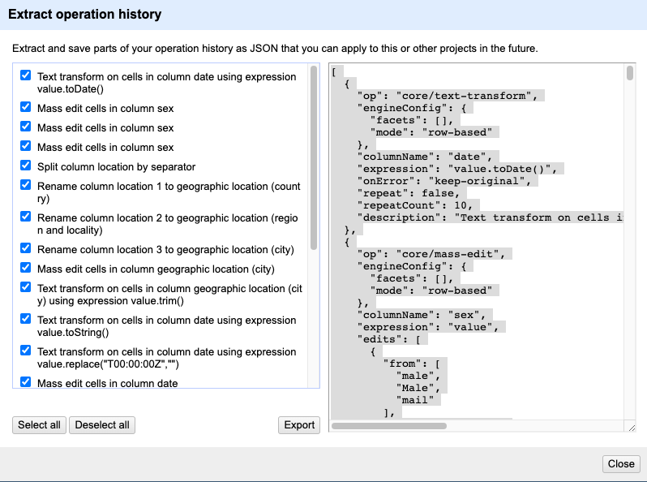

# Lesson

## How OpenRefine records what you have done

As you conduct your data cleaning and preliminary analysis, OpenRefine saves every change you make to the dataset. These
changes are saved in a format known as JSON (JavaScript Object Notation). You can export this JSON script and apply it to other data files. If you had 20 files to clean, and they all had the same type of errors (e.g. misspellings, leading white spaces), and all
files had the same column names, you could save the JSON script, open a new file to clean in OpenRefine, paste in the script and run it.
This gives you a quick way to clean all of your related data.

## Saving your work as a script

1. In the `Undo / Redo` section, click `Extract...` and a pop-up window with the history will appear. To the left, the steps in your history will appear as text descriptions and to the right the corresponding steps are shown in the JSON format.

2. Select the steps that you want to apply to other datasets by ticking the relevant check boxes.
3. Click `Export`, this will download a file named `history.json` to your default download folder. Locate it on your computer and rename it `data_cleaning_script.json`. To inspect the you can open it a text editor or in your browser.

## Importing a script to use against another dataset

Let's practice running these steps on a new dataset. We'll test this on an uncleaned version of the dataset we've been working with.

1. Start a new project in OpenRefine using the messy dataset you downloaded before (`samples_openrefine_lesson.csv`). Give the project a new name.  
2. Click the `Undo / Redo` tab > `Apply` and paste in the contents of the `data_cleaning_script.json` file you just created with the JSON code. If you have not opened it in a text editor you can also open it in your browser to copy the content. To copy you can right click the selected text or use the shortcuts cmd+c and cmd+v for Mac or ctrl+c and ctrl+v for Windows.
3. Click `Perform operations`. The dataset should now be the same as your other cleaned dataset.

For convenience, we used the same dataset. In reality you could use this process to clean related datasets. For example, data that you had collected over different fieldwork periods or data that was collected by different researchers (provided everyone uses the same column headings).


